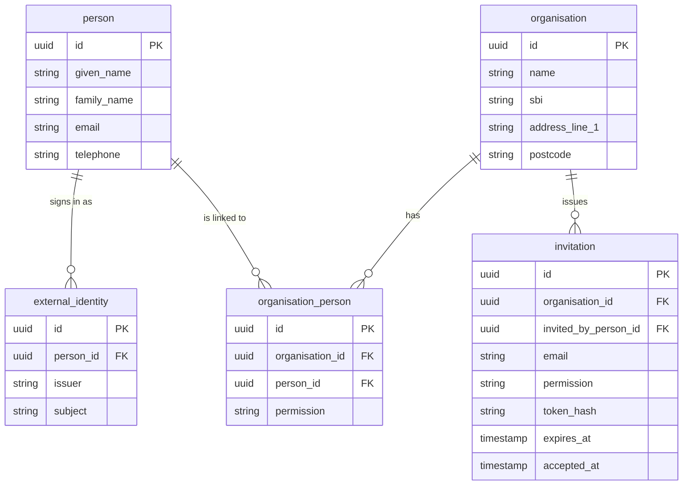

# GOV.UK One Login example service

An example farming service that signs users in with [GOV.UK One Login](https://www.sign-in.service.gov.uk/)
and links each One Login account to a farming business.

It is built with Node.js, TypeScript and hapi, uses the
[GOV.UK Design System](https://design-system.service.gov.uk/) for every page, PostgreSQL for
customer records and Redis for sessions. Locally it runs against the official
[GOV.UK One Login simulator](https://docs.sign-in.service.gov.uk/test-your-integration/gov-uk-one-login-simulator/),
so no credentials from the real service are needed.

## What it demonstrates

- Authorisation code flow with PKCE and `private_key_jwt` client authentication.
- ID token verification against the provider's JWKS, including nonce and vector of trust checks.
- Server side sessions in Redis, keyed by an opaque cookie, with the One Login tokens held server side.
- A first time registration journey that cannot be completed twice by the same One Login account.
- A farming business (organisation) with people linked to it, each holding an owner or member permission.
- Invitations by email with a single use, hashed, expiring token.
- Sign out at both the service and GOV.UK One Login, with the local session dropped first.

## Prerequisites

- Node.js 24 or later (see [.nvmrc](.nvmrc))
- Docker and Docker Compose

The app itself always runs on the host. Docker is only used for the dependencies:
PostgreSQL, Redis, Liquibase and the One Login simulator.

## Running locally

```
npm install
npm run local
```

`npm run local` does three things:

1. `npm run keys:generate` writes a development RSA key pair and cookie password into `.env`
   (see [.env.example](.env.example) for the full list of variables). It is idempotent, so an
   existing `.env` is left alone unless you pass `--force`.
2. `npm run services:up` starts PostgreSQL, Redis and the simulator, then runs the Liquibase migrations.
3. `npm run dev` starts the service on <http://localhost:3000> with file watching.

Stop the dependencies with `npm run services:down`. The PostgreSQL and Redis volumes are
persistent, so customer records survive a restart.

### Signing in

The simulator runs in interactive mode. When the service redirects you to
<http://localhost:3005>, you get a form where you choose the `sub` (the One Login user
identifier) and the email address that will be returned. Use a different `sub` to act as a
different user, which is how you test the invitation journey end to end.

### The user journey

| Step | What happens |
| --- | --- |
| `/` | GOV.UK start page with a start button |
| `/auth/sign-in` | Redirects to GOV.UK One Login |
| `/auth/callback` | Verifies the ID token, creates the session, then routes to registration or the business list |
| `/register/your-name` | Name and contact details, check your answers, confirmation. Only reachable once per One Login account |
| `/organisations` | Every business the signed in person is linked to, with their permission |
| `/organisations/create` | Create a business. The creator becomes the owner. Duplicate SBIs are rejected |
| `/organisations/{id}` | Business details and the people linked to it |
| `/organisations/{id}/invite` | Owners only. Creates an invitation link for an email address |
| `/invitations/{token}` | Accepts an invitation. Requires signing in with a One Login account whose email matches |
| `/account` | The signed in person's own details |
| `/sign-out` | Ends the local session and signs out of GOV.UK One Login |

## Data model



- `external_identity` keeps the One Login `sub` separate from the person record. A person could
  gain another identity provider later without changing anything else.
- `organisation_person.permission` is `owner` or `member`, enforced by a check constraint.
- A unique constraint on `(issuer, subject)` is what stops the same One Login account
  registering twice, and a unique constraint on `organisation.sbi` stops duplicate businesses.
- `audit_event` records registrations, business creation and invitation activity.

Migrations live in [changelog](changelog) and are applied by Liquibase. Run them on their own
with `npm run db:migrate`.

## Security notes

These are the practices worth copying into a real service.

- **PKCE (`S256`) and `private_key_jwt`.** No client secret is ever sent. The token request is
  authenticated with a short lived JWT assertion signed by the service's private key
  ([src/auth/client-assertion.ts](src/auth/client-assertion.ts)).
- **Nonce.** A nonce is generated per sign in, stored in the session, sent on the authorisation
  request and compared against the ID token claim. This is separate from the OAuth `state`,
  which bell handles ([src/auth/nonce.ts](src/auth/nonce.ts)).
- **Full ID token verification.** Signature against the cached JWKS, plus issuer, audience,
  algorithm, expiry, required claims and vector of trust
  ([src/auth/verify-id-token.ts](src/auth/verify-id-token.ts)).
- **Opaque session cookie.** The cookie holds a random session id only. Access, refresh and ID
  tokens are stored in Redis ([src/auth/session-store.ts](src/auth/session-store.ts)), so they
  never reach the browser and can be revoked instantly.
- **Hashed invitation tokens.** Only a SHA-256 hash is stored, so a database leak does not hand
  over working invitation links. Tokens are single use and expire after seven days
  ([src/services/invitations.ts](src/services/invitations.ts)).
- **404 rather than 403 for non-members.** Asking for a business you are not linked to returns
  "page not found", so the response cannot be used to confirm that a business exists
  ([src/auth/require-membership.ts](src/auth/require-membership.ts)).
- **Content Security Policy with per request nonces**, so no inline script or style is allowed
  by origin alone ([src/plugins/content-security-policy.ts](src/plugins/content-security-policy.ts)).
- **CSRF tokens** on every state changing form, via `@hapi/crumb`.
- **Open redirect protection.** The `redirect` parameter is validated as a same site relative
  path before it is used ([src/utils/get-safe-redirect.ts](src/utils/get-safe-redirect.ts)).
- **Fail fast configuration.** Convict validates strictly at startup, and a missing or malformed
  private key stops the process rather than failing on the first sign in
  ([src/config](src/config)).

Many of these patterns are adapted from the Defra Identity example service, which integrates
with a similar OIDC provider.

### Known dependency advisory

`npm audit` reports two low severity findings for `@hapi/joi`, pulled in by `blankie` (the CSP
plugin). There is no forward fix: `@hapi/joi` stopped receiving releases at 17.1.1 and every
version of `blankie` depends on it. The only "fix" npm offers is a downgrade to `blankie` 4.1.1,
which depends on the same vulnerable package. `blankie` only validates its own CSP options at
startup, so no user input reaches it.

## Testing

```
npm test                 # typecheck, then unit and integration tests with coverage
npm run test:unit        # fast, no containers
npm run test:integration # starts PostgreSQL, Redis and Liquibase with testcontainers
npm run test:watch
```

Integration tests do not use the compose stack. They start their own throwaway containers
([test/setup/global-services.ts](test/setup/global-services.ts)) along with a small stub of the
OpenID discovery document, and drive the app through `server.inject` with a real Redis session
([test/integration/helpers/test-client.ts](test/integration/helpers/test-client.ts)).

## Other commands

```
npm run typecheck   # TypeScript is used for type checking only, Node runs .ts files natively
npm run lint
npm run lint:fix
npm run dev:debug   # dev server with the inspector on 9229
npm start           # production mode
```

VS Code launch configurations are included for running the server and debugging the current
test file.

## Differences from production GOV.UK One Login

- The simulator issues ID tokens and user info without any real identity assurance. This
  service requests `Cl.Cm` (multi-factor authentication) and does not attempt identity proving
  (`P2`), so there is no `coreIdentityJWT` handling here.
- Back channel logout is not implemented. A production service should register a back channel
  logout URI so that a sign out elsewhere invalidates the local session.
- Invitations are not emailed. The invitation link is shown on screen instead.
- The [Dockerfile](Dockerfile) is for deployment only. Local development runs the app on the host.

## Licence

[MIT](LICENCE).
